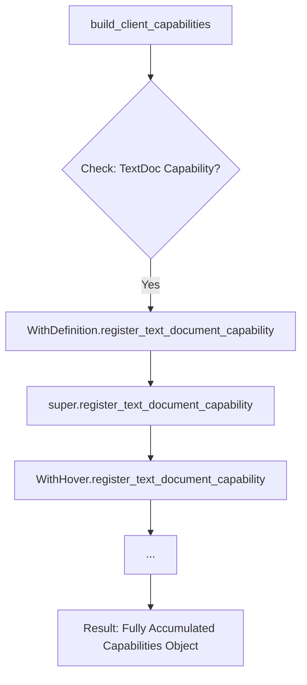

# lsp-client: Architectural Design & Replication Guide

This document provides an in-depth analysis of the core design patterns used in `lsp-client`. It serves as a technical blueprint for engineers looking to replicate this architecture in other languages (e.g., Rust, Go, TypeScript).

---

## 1. Recursive Capability Discovery (MRO-based)

### Design Core
The architecture leverages **Method Resolution Order (MRO)** and multiple inheritance to aggregate protocol parameters from decentralized "Capability Mixins" into a unified client declaration.

### Logic Flow


### Replication Pseudo-code (Rust/Trait approach)
```rust
// Define the base capability interface
trait LspCapability {
    fn register_client_cap(&self, caps: &mut ClientCapabilities);
}

// Module-specific implementation
impl LspCapability for DefinitionModule {
    fn register_client_cap(&self, caps: &mut ClientCapabilities) {
        // Accumulate specific field into the shared container
        caps.text_document.definition = Some(DefinitionClientCapabilities { ... });
    }
}

// Client aggregation
struct MyLspClient {
    capabilities: Vec<Box<dyn LspCapability>>
}

impl MyLspClient {
    fn build_initialize_params(&self) -> InitializeParams {
        let mut caps = ClientCapabilities::default();
        for cap in &self.capabilities {
            cap.register_client_cap(&mut caps); // Simulating the recursive accumulation
        }
        InitializeParams { capabilities: caps, .. }
    }
}
```

> **Engineer's Note**: Languages without native MRO (like Go or TS) should use **Explicit Registration**. Manually maintain a list of modules and iterate over them during initialization rather than relying on implicit inheritance chains.

---

## 2. Response Routing & Async Decoupling

### Design Core
Uses a **Global ID Mapping Table** combined with **One-shot Channels** to realign the asynchronous JSON-RPC request-response flow.

### Sequence Diagram
```mermaid
sequenceDiagram
    participant User as Caller (Async Task)
    participant Table as OneShotTable
    participant Server as Remote LSP Server
    participant Loop as Background Read Loop

    User->>Table: Register ID=123, Create Channel(tx, rx)
    User->>Server: Send Request (id: 123)
    User->>User: await rx.receive()
    
    Server-->>Loop: Raw Response (id: 123)
    Loop->>Table: pop(123) -> Retrieve tx
    Loop->>Table: tx.send(Result)
    Table->>User: Wake up and return data
```

---

## 3. Template Method for Server-Specific Config

### Design Core
Utilizes the **Template Method Pattern** to allow specific clients (e.g., Pyright, Rust-Analyzer) to define unique initialization options while keeping the core lifecycle logic consistent.

### Implementation Logic
```python
class LSPClient(ABC):
    async def initialize(self):
        # Core Lifecycle
        options = self.create_initialization_options() # The Hook
        params = self.build_params(options)
        await self.request("initialize", params)

    @abstractmethod
    def create_initialization_options(self) -> dict:
        return {} # Default implementation

class PyrightClient(LSPClient):
    def create_initialization_options(self) -> dict:
        # Override with server-specific logic
        return {
            "diagnosticMode": "workspace",
            "analysis": { "autoSearchPaths": True }
        }
```

---

## 4. Server-to-Client Hook Registry

### Design Core
A centralized **Registry** allows mixins to independently declare handlers for server-initiated requests (e.g., `workspace/configuration`) or notifications (e.g., `publishDiagnostics`).

### Dispatching Logic (Pseudo-code)
```typescript
// Logic inside the background read loop
async function onPackageReceived(pkg: RawPackage) {
    if (isNotification(pkg)) {
        const handlers = registry.get(pkg.method);
        for (const handler of handlers) {
            // Trigger all registered capability handlers
            await handler(pkg.params);
        }
    } else if (isServerRequest(pkg)) {
        const handler = registry.getSingle(pkg.method);
        const result = await handler(pkg.params);
        await transport.sendResponse(pkg.id, result);
    }
}
```

---

## 5. Abstract Transport Layer (Strategy Pattern)

### Design Core
Decouples the client core from the underlying I/O mechanism. The client communicates with an abstract interface, whether the server is a local process, a Docker container, or a remote socket.

### Interface Definition
```typescript
interface LSPServer {
    send(data: string): Promise<void>;
    receive(): AsyncIterable<string>;
    start(): Promise<void>;
    stop(): Promise<void>;
}
```

---

## Replication Checklist
- [ ] **Ordered Registration**: In languages without MRO, ensure capability registration functions execute in a predictable order.
- [ ] **Concurrency-Safe Registry**: Ensure the ID-to-Channel mapping is thread-safe or handled within a single-threaded event loop.
- [ ] **URI/Path Translation**: Implement a robust utility for `path <-> uri` conversion, especially when dealing with Docker volume mounts.
- [ ] **Structured Concurrency**: Bind the background Read Loop's lifetime to the Client instance to prevent resource leaks.
- [ ] **Strongly Typed Schema**: Prefer generating types from the LSP Meta-model (3.17) rather than using untyped JSON objects.
